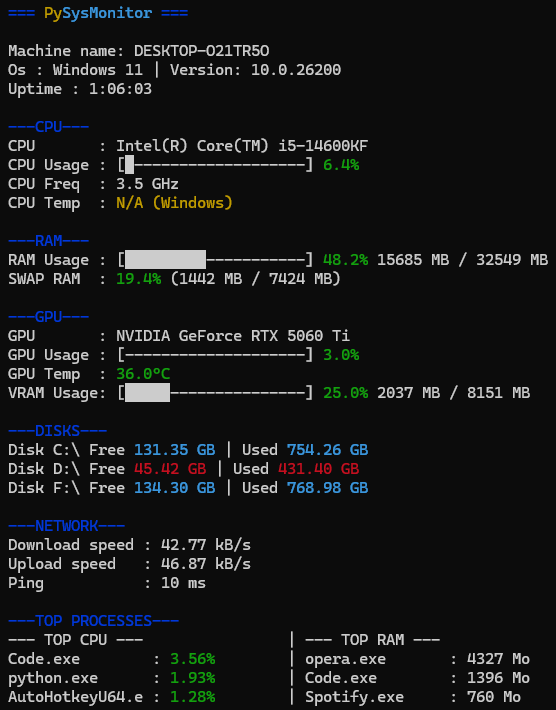
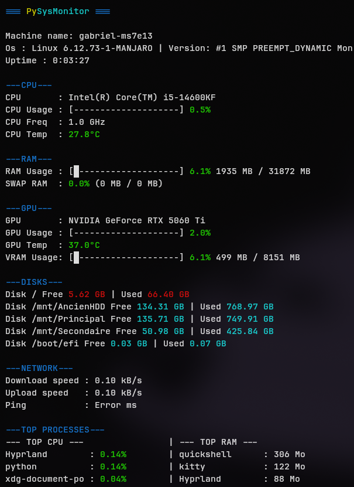
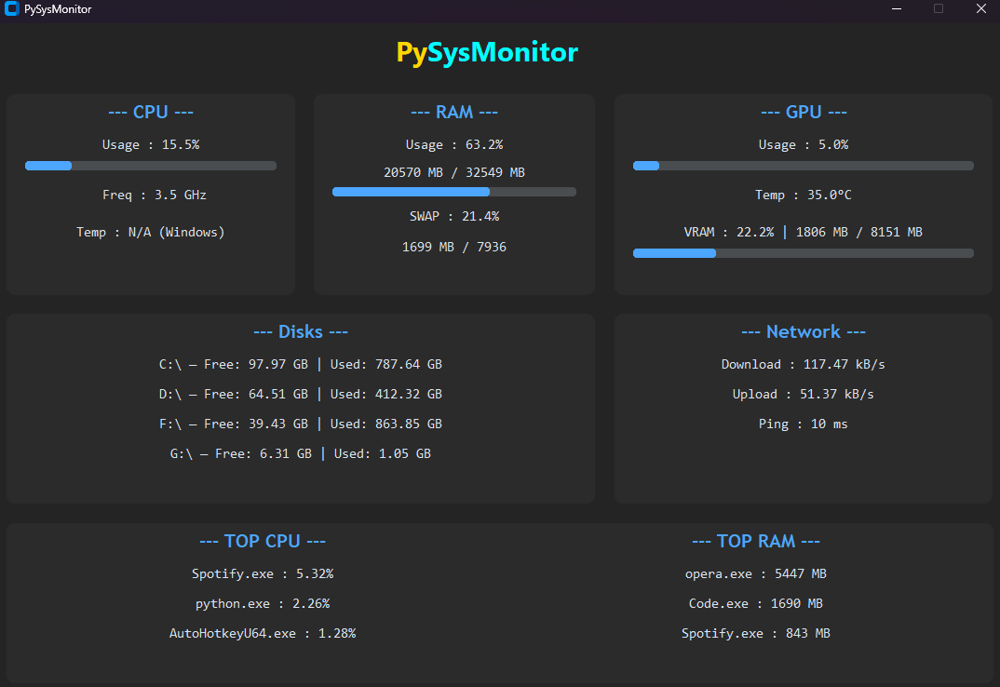

# 🖥️ PySysMonitor

A lightweight, real-time system resource monitor built in Python, displayed directly in your terminal with dynamic color-coding.

| Windows | Linux |
|---|---|
|  |  |

> ⚠️ Linux support is functional but may have minor bugs. Contributions welcome!

| GUI (in progress) |
|---|
|  |
---

## 📊 Features

- **System Info** — Machine name, OS, uptime
- **CPU** — Name, usage, frequency
- **RAM** — Physical and SWAP usage with progress bars
- **GPU** — Usage, temperature and VRAM (NVIDIA only via GPUtil)
- **Disks** — All detected partitions with free/used space
- **Network** — Live download/upload speeds and ping
- **Top Processes** — Top 3 apps by CPU and RAM usage (grouped by application)
- **CPU Temperature** — Linux only *(Windows blocks access to hardware sensors from Python)*

---

## 🛠️ Installation

### Windows

```bash
git clone https://github.com/Gague35/PySysMonitor.git
cd PySysMonitor
pip install psutil gputil colorama py-cpuinfo
```

### Linux (Ubuntu/Debian)

```bash
git clone https://github.com/Gague35/PySysMonitor.git
cd PySysMonitor
pip install psutil gputil colorama py-cpuinfo
```

### Linux (Arch/Manjaro)

> ⚠️ `pip` is blocked system-wide on Arch-based distros. Use `pacman` instead :

```bash
sudo pacman -S python-psutil python-colorama
pip install gputil py-cpuinfo --break-system-packages
```

---

## 🚀 Usage

```bash
python main.py
```
or
```bash
python gui.py
```
Press `Ctrl+C` to exit.

---

## ⚠️ Known Limitations

| Feature | Windows | Linux |
|---|---|---|
| CPU Temperature | ❌ Not available | ✅ |
| GPU Monitoring | ✅ NVIDIA only | ✅ NVIDIA only |

---

## 📚 Dependencies

| Library | Usage |
|---|---|
| [psutil](https://github.com/giampaolo/psutil) | CPU, RAM, disk, network, processes |
| [GPUtil](https://github.com/anderskm/gputil) | GPU monitoring (NVIDIA) |
| [colorama](https://github.com/tartley/colorama) | Terminal colors |
| [py-cpuinfo](https://github.com/workhorsy/py-cpuinfo) | CPU name detection |
| [customtkinter](https://github.com/TomSchimansky/CustomTkinter) | GUI interface |

---

## 📅 Roadmap

- [x] v1 — CLI monitor
- [ ] v1.5 - Support for AMD GPUs (and attempt at macOS support) and many other features *(⚠️ may never be available because too difficult)*
- [ ] v2 — Dedicated GUI application ***(🚧in progress🚧)***

## 📄 License
This project is licensed under the MIT License. See the [LICENSE](LICENSE) file for details.